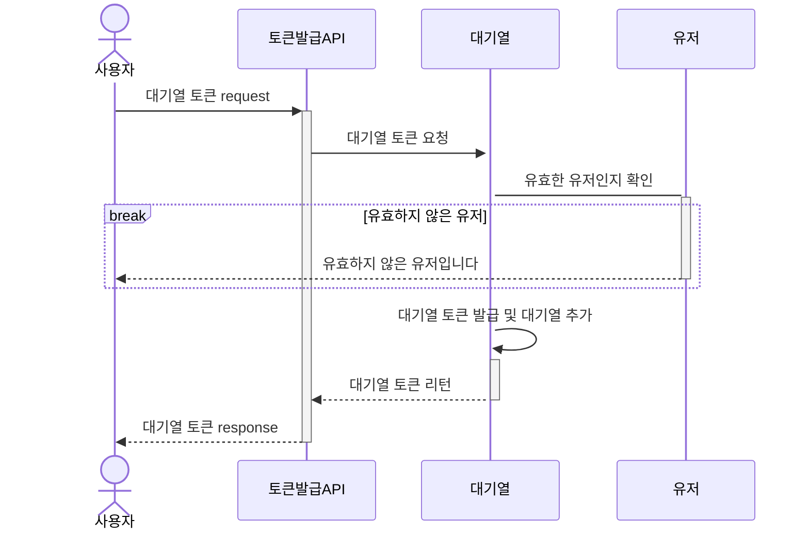
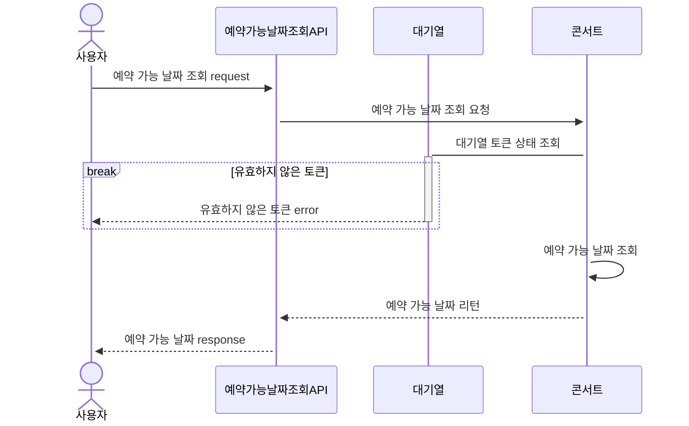
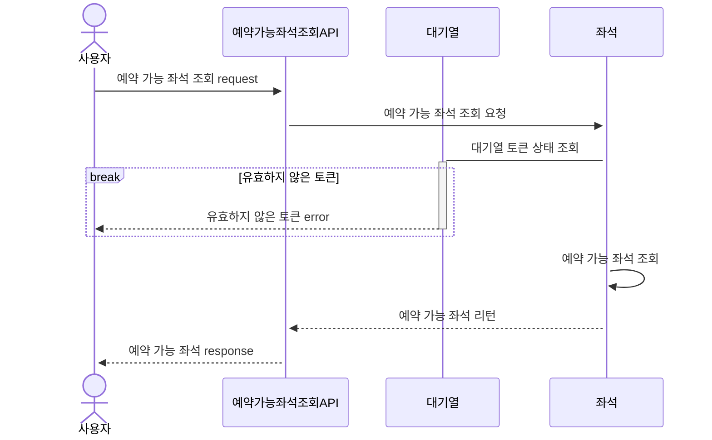
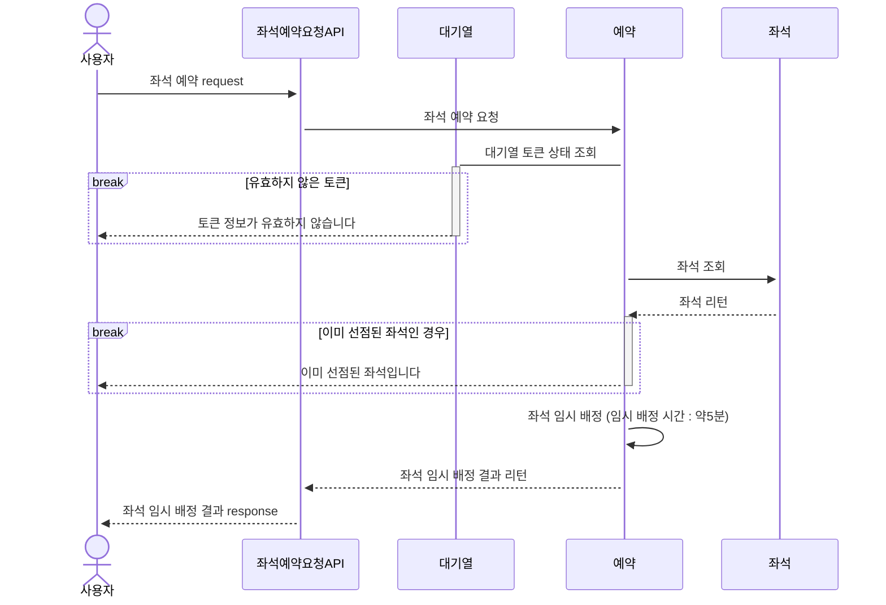
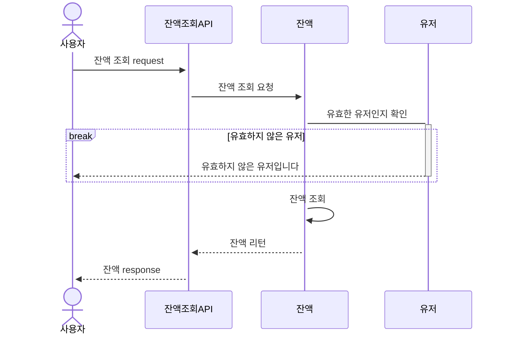
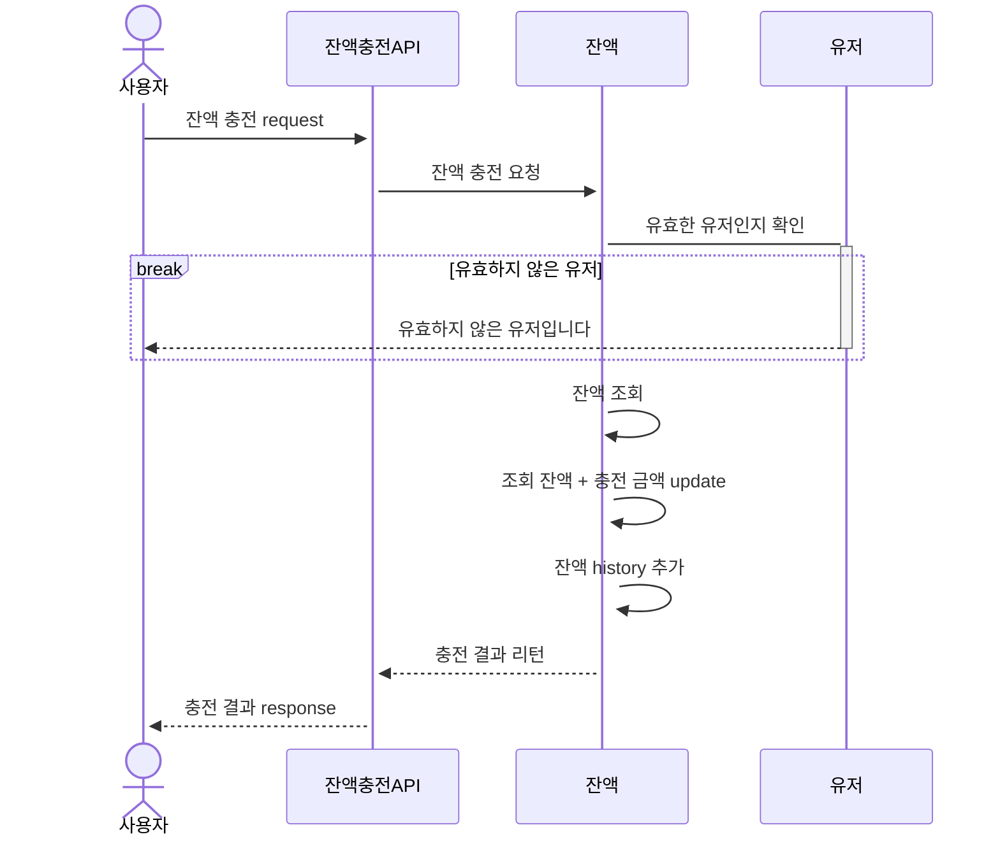
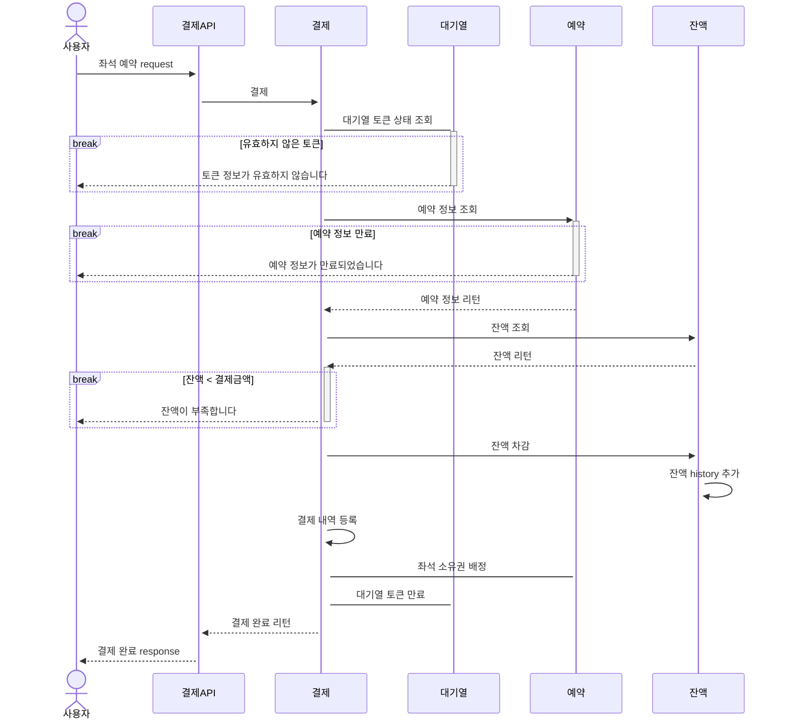

Milestone(https://github.com/users/jangyoojeong/projects/1)

### 1. 유저 대기열 토큰 발급 API 

---

### 2. 예약 가능 날짜 / 좌석 API

#### 2-1. 예약 가능 날짜 조회 API

#### 2-2. 예약 가능 좌석 조회 API

---

### 3. 좌석 예약 요청 API

---

### 4. 잔액 충전 / 조회 API

#### 4-1. 잔액 조회 API

#### 4-2. 잔액 충전 API

---

### 5. 결제 API

